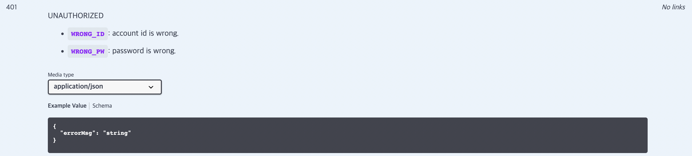

# Swagger Error Response Extension
|Latest Version| Build                                                                                                                                         | Coverage | License Scan                                                                                                                                                                                                                                             | License                                                                                                     | Contribution                                                                                                                                    |
|--------------|-----------------------------------------------------------------------------------------------------------------------------------------------|---------|----------------------------------------------------------------------------------------------------------------------------------------------------------------------------------------------------------------------------------------------------------|-------------------------------------------------------------------------------------------------------------|-------------------------------------------------------------------------------------------------------------------------------------------------|
|[](https://jitpack.io/#TaegyunWoo/swagger-error-response-extension)| [](https://jitci.com/gh/TaegyunWoo/swagger-error-response-extension)         |[](https://codecov.io/github/TaegyunWoo/swagger-error-response-extension)| [](https://app.fossa.com/projects/git%2Bgithub.com%2FTaegyunWoo%2Fswagger-error-response-extension?ref=badge_shield) | [](https://opensource.org/licenses/MIT) |  [](https://github.com/TaegyunWoo/swagger-error-response-extension/pulls) |

|Spring Boot| Compatible | SpringFox | Compatible |SpringDoc|Compatible|
|-----------|------------|-----------|------------|----------|---|
|2.7.7| ✅  | 3.0.0     | ✅  |✖️|✖️|

| Demo Project                                                                                                                                                                                                                                                                   | English README.md     |
|--------------------------------------------------------------------------------------------------------------------------------------------------------------------------------------------------------------------------------------------------------------------------------|-----------------------|
| [](https://github.com/TaegyunWoo/swagger-error-response-extension-demo) | [English README.md](https://github.com/TaegyunWoo/swagger-error-response-extension) |

<br/>

## Core Directories

```text
.
├── README.md
├── doc                                                 : Library Documents
├── jitpack.yml                                         : Jitpack Deployment Setting Properties
└── springfox-extension                                 : Module for springfox
    ├── build.gradle
    └── src
        ├── main
            ├── java/springfox/error/response/extension
                ├── annotation                          : all annotations
                ├── configuration                       : spring bean configuration
                ├── exception                           : all exceptions
                └── service                             : core logics
                    └── accessor                        : springfox accessor
            └── resources
        └── test                                        : test codes
```

<br/>

## Index
- [Swagger Error Response Extension 가 무엇인가요?](#swagger-error-response-extension-가-무엇인가요)
- [왜 필요한가요?](#왜-필요한가요)
- [어떻게 사용하나요? - SpringFox](#어떻게-사용하나요---springfox)
- [커스터마이징 - SpringFox](#커스터마이징---springfox)
- [어떻게 사용하나요? - SpringDoc](#어떻게-사용하나요---springdoc)
- [커스터마이징 - SpringDoc](#커스터마이징---springdoc)
- [앞으로의 계획](#앞으로의-계획)

<br/>

## Swagger Error Response Extension 가 무엇인가요?
Swagger Error Response Extension 은 개발자가 직접 정의한 오류코드 정보를 간편하게 Swagger Response Description 에 추가해주는 간단한 오픈소스 라이브러리입니다.

아래 그림처럼요!



Spring 진영에서 Swagger를 사용하기 위해 사용하는 `SpringFox`나 `SpringDoc` 라이브러리 위에서 동작합니다.

> 현재는 `SpringFox` 만 지원하는 중입니다.

<br/>

## 왜 필요한가요?
### 먼저 개발자는 왜 직접 정의한 오류코드를 사용할까요?

다양한 이유가 있겠지만, 가장 중요한 이유는 바로 Client 개발자와 Server 개발자 간의 원활한 소통과 로직 개발을 돕기 위해서 입니다.

예를 들어볼까요?

우리는 로그인 API를 만들려고 하는 Server 개발자라고 해봅시다.

그리고 `존재하지 않는 id로 로그인을 시도한 경우`와 `틀린 비밀번호로 로그인을 시도한 경우` 모두 사용자에게 알려줘야 한다는 요구사항이 있습니다.

그렇다면 각 실패 케이스마다, 다른 오류코드를 갖는 응답을 하도록 API를 구현해야합니다.

- `존재하지 않는 id` -> `WRONG_ID` 코드 응답
- `틀린 비밀번호` -> `WRONG_PW` 코드 응답

위와 같이 API를 만들어두고, `WRONG_ID`, `WRONG_PW` 라는 오류코드를 정의해서 응답하도록 구현했다고 Client 개발자에게 알려주면 됩니다.

> 'Client 개발자에게 알려줘야한다는 점'이 Swagger Error Response Extension 라이브러리가 필요한 이유입니다!  
자세한 것은 계속 설명할게요.

그럼 Client 개발자가 각 오류코드를 보고, 그 코드에 맞춰 사용자에게 어떤 알림을 띄울지 결정할 수 있습니다.

<br/>

### 그럼 어떻게 이 오류코드를 Client 개발자에게 간단명료하게 알려줄 수 있을까요?
이 오류코드들을 외부 Document에 정리하고 개발자들끼리 공유하는 것도 하나의 방법일 수 있습니다.

하지만 Swagger 를 통해 API Documentation을 하고 있을 때, 관련 API 문서 설명에 이 오류코드들을 정리해둔다면 좀 더 편하지 않을까요?

<br/>

### 좋습니다. 그러면 Swagger 에 이 오류코드들을 직접 추가해봅시다!
만약 `SpringFox` 를 통해 Swagger를 사용할 때, 직접 오류코드에 대한 설명을 아래와 같이 추가하면 됩니다.

```java
@ApiResponses(value = {
      @ApiResponse(responseCode = "401", description = "WRONG_ID: account id is not exists. WRONG_PW: wrong password.") //Add Description
})
@GetMapping("/login")
String login(@RequestBody RequestDto requestDto) {
  return "login succeed";
}
```

이렇게 직접 설명을 추가하는 것도 효과적입니다.

하지만 한 API의 오류코드가 10개가 넘어가거나, 기존에 있던 오류코드가 제거된다면 어떨까요?

직접 일일이 설명을 추가하거나 수정하면 됩니다! 하지만 어떤 실수도 없이 수정할 자신이 있나요?

<br/>

### 그래서 Swagger Error Response Extension 가 탄생했습니다.
이런 불편함을 개선하기 위해, Swagger Error Response Extension은 **Enum을 통해 오류코드를 관리**합니다.

Enum 클래스에 오류코드와 설명을 정의해두고 그것을 컨트롤러에서 import 하면, **관련 정보들이 자동으로 Swagger Response API의 description에 추가**됩니다.

또한 **오류 코드를 관리하는 point를 enum 클래스 한 곳**으로 모을 수 있습니다. 즉, enum 클래스만 관리해도 오류코드에 대한 설명를 제어할 수 있습니다.

마지막으로 오류 코드를 enum 클래스로 관리하므로, **실제 로직에서 enum 클래스를 사용할 수 있으며, 이것을 그대로 Swagger 까지 가져와 사용**할 수 있습니다. 

<br/>

## 어떻게 사용하나요? - SpringFox
### Gradle Dependencies
먼저 `build.gradle`에 의존성을 추가합니다.

```groovy
repositories {
	maven { url 'https://jitpack.io' } //Add JitPack Repository
}
dependencies {
    implementation 'org.springframework.boot:spring-boot-starter'
    implementation 'org.springframework.boot:spring-boot-starter-web'
    implementation 'io.springfox:springfox-boot-starter:3.0.0'                     //Add SpringFox Library
    implementation 'com.github.TaegyunWoo:swagger-error-response-extension:v1.1.2' //Add Swagger Error Response Extension Library
}
```

<br/>

### Swagger Configuration
SpringFox를 사용하기 위한 기본 설정을 진행합니다.

```java
@Configuration
public class SwaggerConfig {
  
  @Bean
  public Docket customImplementation(TypeResolver typeResolver){
    return new Docket(DocumentationType.OAS_30)
        .additionalModels(
            typeResolver.resolve(ErrorResponseDto.class) //your DTO class for response error (Optional)
        )
        .select()
        .apis(RequestHandlerSelectors.basePackage("com.example.demo.controller")) //your base package of controller
        .build();
  }

}
```

<br/>

### Error Enum
이제 본격적으로 Swagger Error Response Extension 를 사용해봅시다.

먼저 오류코드 정보를 담을 Enum 클래스를 정의합니다.

```java
import org.springframework.http.HttpStatus;
import springfox.error.response.extension.service.ErrorEnumInfo;

public enum LoginErrorCode implements ErrorEnumInfo {
  WRONG_ID(HttpStatus.valueOf(401), "account id is wrong."),
  WRONG_PW(HttpStatus.valueOf(401), "password is wrong.");
  
  private HttpStatus code;
  private String description;

  LoginErrorCode(HttpStatus code, String description) {
    this.code = code;
    this.description = description;
  }

  @Override
  public String getDescription() {
    return description;
  }

  @Override
  public HttpStatus getCode() {
    return code;
  }
}
```

- 에러 정보가 담길 Enum 은 무조건 `springfox.error.response.extension.service.ErrorEnumInfo` 인터페이스를 implements 해야합니다.
- 2개의 Field를 선언해야 합니다. **(Field 이름이 동일해야 하는 것에 주의하세요!)**
  - `private HttpStatus code`
  - `private String description`
- `code`, `description` 파라미터를 갖는 생성자를 선언합니다.
- 각 Field의 getter 메서드를 override 합니다.
- enum 상수를 선언하고, 각 Field에 오류정보를 적절히 담습니다.
  - enum constant -> error code
  - `code` Field -> HttpStatus Code
  - `description` Field -> description of error code

<br/>

### Controller
위에서 정의한 enum을 컨트롤러(Swagger API)에 적용하면 됩니다.

```java
@RequestMapping("/login")
@RestController
public class Controller {
  
  //from swagger-error-response-extension
  @ErrorResponse(errorEnums = {LoginErrorCode.class}, content = @Content(mediaType = "application/json", schema = @Schema(implementation = ErrorResponseDto.class)))
  //from springfox
  @ApiResponses(value = {
          @ApiResponse(responseCode = "401", description = "WRONG_ID: account id is not exists. WRONG_PW: wrong password.") //Add Description
  })
  @GetMapping()
  String login(@RequestBody RequestDto requestDto) {
    return "login succeed";
  }
  
}
```

모든 설정이 끝났습니다!

이제 아래와 같은 결과를 확인할 수 있습니다.


<br/>

## 커스터마이징 - SpringFox
만약 다른 형태로 swagger response description을 구성하고 싶다면, `ErrorResponseDescriptionBuilder` 인터페이스를 구현하면 됩니다.

```java
import org.springframework.context.annotation.Primary;
import org.springframework.stereotype.Component;
import springfox.error.response.extension.annotation.ErrorResponse;
import springfox.error.response.extension.service.ErrorResponseDescriptionBuilder;

import java.util.HashMap;
import java.util.Map;

@Component //add bean
@Primary //apply this component instead of library component
public class CustomErrorResponseDescBuilder implements ErrorResponseDescriptionBuilder {

  @Override
  public Map<String, String> buildDescription(ErrorResponse errorResponseAnno) {
    // map to save description per http status
    Map<String, String> descriptionMap = new HashMap<>(); //<HTTP Status, Description>

    descriptionMap.put("404", "This is my custom description");

    return descriptionMap;
  }
  
}
```

라이브러리의 `springfox.error.response.extension.service.SimpErrorResponseDescBuilder` 대신 위 component 가 bean으로 등록되고 동작하게 됩니다.

동작원리에 대한 자세한 내용은 [SimpErrorResponseDescBuilder.java](./springfox-extension/src/main/java/springfox/error/response/extension/service/SimpErrorResponseDescBuilder.java) 를 참고하세요.

<br/>

## 어떻게 사용하나요? - SpringDoc
> 추가 예정입니다.

<br/>

## 커스터마이징 - SpringDoc
> 추가 예정입니다.

<br/>

## 앞으로의 계획
- 현재 SpringFox 한정으로 동작합니다. SpringDoc까지 지원하도록 업데이트할 예정입니다. 

<br/>

## License
[](https://app.fossa.com/projects/git%2Bgithub.com%2FTaegyunWoo%2Fswagger-error-response-extension?ref=badge_large)
